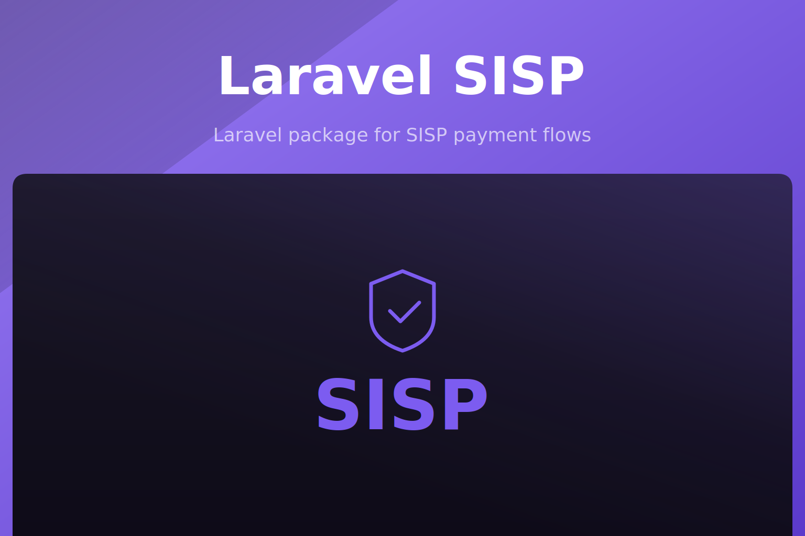

<p align="center"></p>

<p align="center">
<a href="https://packagist.org/packages/akira/laravel-sisp"></a>
<a href="https://packagist.org/packages/akira/laravel-sisp"></a>
<a href="https://github.com/akira-io/laravel-sisp/actions/workflows/run-tests.yml"></a>


</p>

Laravel SISP is a Laravel package for SISP Cabo Verde payment flows, with transaction management, invoice generation, callback validation, sandbox tooling, and multi-merchant credential support.

## Install

```sh
composer require akira/laravel-sisp
php artisan laravel-sisp:install
```

```json
{
  "require": {
    "akira/laravel-sisp": "^0.7"
  }
}
```

| Area | Included |
| --- | --- |
| Payments | Payment request building, SISP form rendering, callbacks, cancellation, retry, and refunds |
| Transactions | Eloquent models, audit logs, reconciliation, and status queries |
| Invoices | PDF invoice generation after approved payments |
| Security | Fingerprint validation, signed retry and cancellation requests, rate limits, metadata collection, and blacklist support |
| Frontend | Blade views and optional Inertia rendering |

## Quick Start

```env
SISP_URL=https://mc.vinti4net.cv/Client_VbV_v2/biz_vbv_clientdata.jsp
SISP_POS_ID=your_pos_id
SISP_POS_AUT_CODE=your_authorization_code
SISP_MERCHANT_ID=your_merchant_id
SISP_SANDBOX=true
```

```blade
<form action="{{ route('sisp.payment') }}" method="POST">
    @csrf

    <input type="number" name="amount" required>
    <input type="text" name="items[0][product_name]" required>
    <input type="number" name="items[0][quantity]" required>
    <input type="number" name="items[0][unit_price]" required>
    <input type="number" name="items[0][total_price]" required>
    <input type="email" name="customer_email">

    <button type="submit">Pay</button>
</form>
```

Use the facade when application code needs lower-level package operations:

```php
use Akira\Sisp\Facades\Sisp;

$transaction = Sisp::reconcileTransactionStatus($transaction);
$countries = Sisp::countries();
```

## Documentation

- [Roadmap](docs/00-roadmap.md)
- [Installation](docs/01-installation.md)
- [Configuration](docs/02-configuration.md)
- [Quick Start](docs/03-quick-start.md)
- [Payment Flow](docs/04-payment-flow.md)
- [Transaction Management](docs/05-transaction-management.md)
- [Invoice Generation](docs/06-invoice-generation.md)
- [Security](docs/07-security.md)
- [Examples](docs/08-examples.md)
- [Troubleshooting](docs/09-troubleshooting.md)
- [FAQ](docs/10-faq.md)
- [API Reference](docs/11-api-reference.md)

Reference documentation is maintained in this repository under [`docs`](docs).

## Testing

```sh
composer test
```

Additional focused checks are available through Composer scripts:

```sh
composer test:coverage
composer test:type-coverage
composer test:types
composer test:lint
```

## Changelog

See [CHANGELOG.md](CHANGELOG.md) for release history. Releases are generated with `git-cliff`.

## Contributing

See [CONTRIBUTING.md](CONTRIBUTING.md) for local setup, test expectations, commit style, and pull request guidance.

## Security

Report security issues through the process documented in [SECURITY.md](SECURITY.md).

## Credits

Laravel SISP is maintained by [Kidiatoliny](https://github.com/Kidiatoliny) and the Akira team. Contributor recognition is managed through [All Contributors](https://allcontributors.org).

## License

Laravel SISP is dual-licensed under [MIT](LICENSE-MIT) or [Apache-2.0](LICENSE-APACHE). Unless you state otherwise, contributions are licensed under both licenses.
